## Vehicle Detection 
---

**Vehicle Detection Project**

The goals / steps of this project are the following:

* Perform a Histogram of Oriented Gradients (HOG) feature extraction on a labeled training set of images and train a classifier Linear SVM classifier
* Normalize the features and randomize a selection for training and testing.
* Implement a sliding-window technique and use the trained classifier to search for vehicles in images.
* Run the pipeline on a video stream (start with the test_video.mp4 and later implement on full project_video.mp4) and create a heat map of recurring detections frame by frame to reject outliers and follow detected vehicles.
* Estimate a bounding box for vehicles detected.

Here I will consider the [rubric points](https://review.udacity.com/#!/rubrics/513/view) individually and describe how I addressed each point in my implementation.

---
### Writeup / README
 
#### 1. Provide a Writeup / README that includes all the rubric points and how you addressed each one.  You can submit your writeup as markdown or pdf. [Here](https://github.com/udacity/CarND-Vehicle-Detection/blob/master/writeup_template.md) is a template writeup for this project you can use as a guide and a starting point.  

The submission includes the following materials: 
- [x] A runnable iPython notebook contains details of my implementation, simply referenced as notebook in below;
- [x] A report, the "Vehicle Detection.md"
- [x] A folder named "img4report" containing the images needed by the report;
- [x] A video, which is generated by the pipeline.

### Histogram of Oriented Gradients (HOG)

#### 1. Explain how (and identify where in your code) you extracted HOG features from the training images.

The code for this step is contained in the notebook section "Rubric 2.1 HOG features exploration".  

I started by reading in all the `vehicle` and `non-vehicle` images. A function is defined to load either the small or big dataset. In the experiment, I used the small set. Here is an example of one of each of the `vehicle` and `non-vehicle` classes:

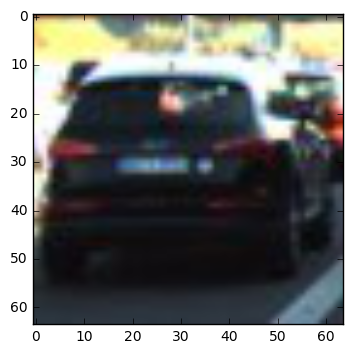
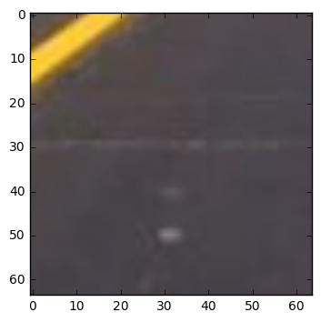

I then explored different color spaces and different `hog()` parameters (`orientations`, `pixels_per_cell`, and `cells_per_block`).  I grabbed random images from each of the two classes and displayed them to get a feel for what the `hog()` output looks like.

Here is an example using the `RGB` color space and HOG parameters of `orientations=9`, `pixels_per_cell=(8, 8)` and `cells_per_block=(2, 2)`:

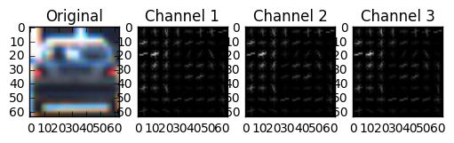

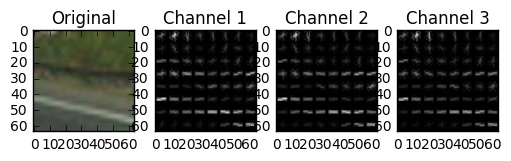

#### 2. Explain how you settled on your final choice of HOG parameters.

The code for exploring different HOG parameters is given in notebook section "Rubric 2.2 Exploring different HOG parameters". I tried different combinations of HOG parameters, the `orientation`, `pixels_per_cell` and `cells_per_block`, and tested them in randomly chose car and non-car images, from the generated HOG images, I finally chose the following combinations, which gives a clear pattern distinction between cars and non-cars, with the minimal features number;
```
color_space = "RGB"
orient = 9
cell_per_block = 2
pix_per_cell = 8  
```

#### 3. Describe how (and identify where in your code) you trained a classifier using your selected HOG features (and color features if you used them).

I used `sklearn.svm`'s `LinearSVC` to perform the classification. The code is given in notebook section "Rubric 2.3, Defining the trainer". 

The `train()` method is defined to perform the training. The function receives the car and non-car features as input, it first performs normalization using `StandardScaler`, and then it construct class labels (1 for cars and 0 for non-cars), and then randomly splits the original data set into training and testing set with a ratio of 0.2. I used the out-of-box SVM parameters. 

Besides the HOG features, I also used the color space histogram features in the training, based on the observation that the in the project video, the cars and the background have a strong color contrast. The other parameters used are listed below:

```
color_space = 'RGB' # Can be RGB, HSV, LUV, HLS, YUV, YCrCb
orient = 9  # HOG orientations
pix_per_cell = 8 # HOG pixels per cell
cell_per_block = 2 # HOG cells per block
hog_channel = "ALL" # Can be 0, 1, 2, or "ALL"
spatial_size = (16, 16) # Spatial binning dimensions
hist_bins = 16    # Number of histogram bins
spatial_feat = False # Spatial features on or off
hist_feat = True # Histogram features on or off
hog_feat = True # HOG features on or off 
```

With these parameters set, I extracted car and noncar features, the total feature length is 5340. 

The I performed the training, the training sample is 1856, and test sample is 465. the test accuracy is 0.9828. The training result is cached for later use.

### Sliding Window Search

#### 1. Describe how (and identify where in your code) you implemented a sliding window search. How did you decide what scales to search and how much to overlap windows?

I used sliding window search to match the cars in the images; the code given in notebook section "Rubric 3.1 Perform sliding window search". 

To limit the search area, and it's also natural to do so, since the cars can not fly in the sky, I defined the following search strategy:
```
x_start_stop = [800, 1280]
y_start_stop = [350, 650]
xy_overlap = (0.9, 0.7)
xy_window=(128, 64)
```

I chose a very `tight` overlap, with value of (0.9, 0.7). The value is based on many experiments, with tight values, it gives more space to regulate the threshold value in later stage, but the downside is much more computation. Below is an example image after performing the sliding window search. 

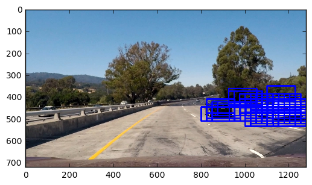

#### 2. Show some examples of test images to demonstrate how your pipeline is working. What did you do to optimize the performance of your classifier?

The pipeline code is contained in notebook section "Rubric 3.2 Defining the pipeline". The pipeline performs the following tasks:

1. it performs sliding window with given parameters;
2. it matches the sliding window one by one to detect if the image patch matches a car or not, using the pre-trained classifier;
3. the matched sliding window is returned;
4. since the matched window may have false-positive or multiple matches, a clean work is performed based on heat-map technique. 

Below is example images by applying the pipeline:

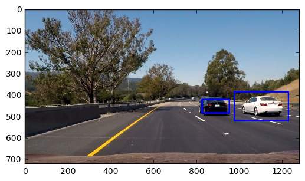
---

### Video Implementation

#### 1. Provide a link to your final video output. Your pipeline should perform reasonably well on the entire project video (somewhat wobbly or unstable bounding boxes are OK as long as you are identifying the vehicles most of the time with minimal false positives.)

The video is included in the submission package, named "project_video_output.mp4"

#### 2. Describe how (and identify where in your code) you implemented some kind of filter for false positives and some method for combining overlapping bounding boxes.

The code is given in the notebook section "Rubric 3.2 Defining the pipeline". 
I recorded the positions of positive detections in each frame of the video.  From the positive detections I created a heatmap and then thresholded (the valued I used is 3) that map to identify vehicle positions.  I then used `scipy.ndimage.measurements.label()` to identify individual blobs in the heatmap.  I then assumed each blob corresponded to a vehicle.  I constructed bounding boxes to cover the area of each blob detected.  

Here's an example result showing the heatmap from a series of frames of video, the result of `scipy.ndimage.measurements.label()` and the bounding boxes then overlaid on the last frame of video:

**Here are six frames of original images, boxed images, heatmap and cleaned images**

1. 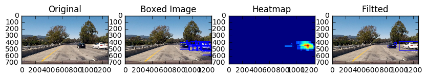
1. 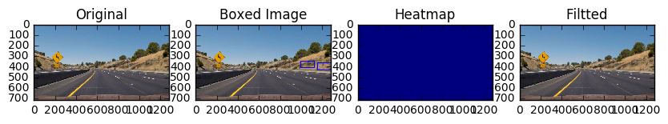
1. 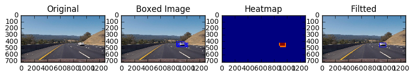
1. 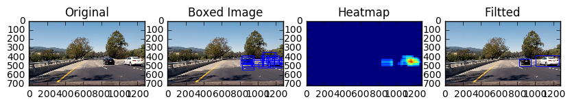
1. 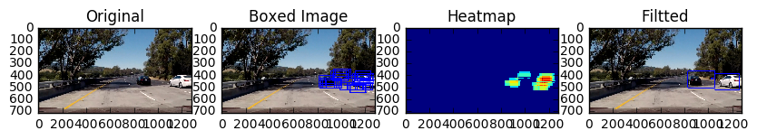
1. 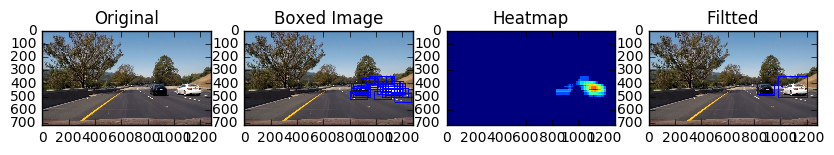

---

### Discussion

#### 1. Briefly discuss any problems / issues you faced in your implementation of this project.  Where will your pipeline likely fail?  What could you do to make it more robust?

There are several problems:
1. The fist problem is the extracted features, whether are not they are the best features is fully tested; 
2. The parameters chose is not necessarily the optimum one, although I tried many different combinations, they are not enough;
3. In the video stream, some frames are failed in detection caused by the brightness of the image, maybe a HLS color space would do better than the RGB;
4. The computation time currently is slow. 

